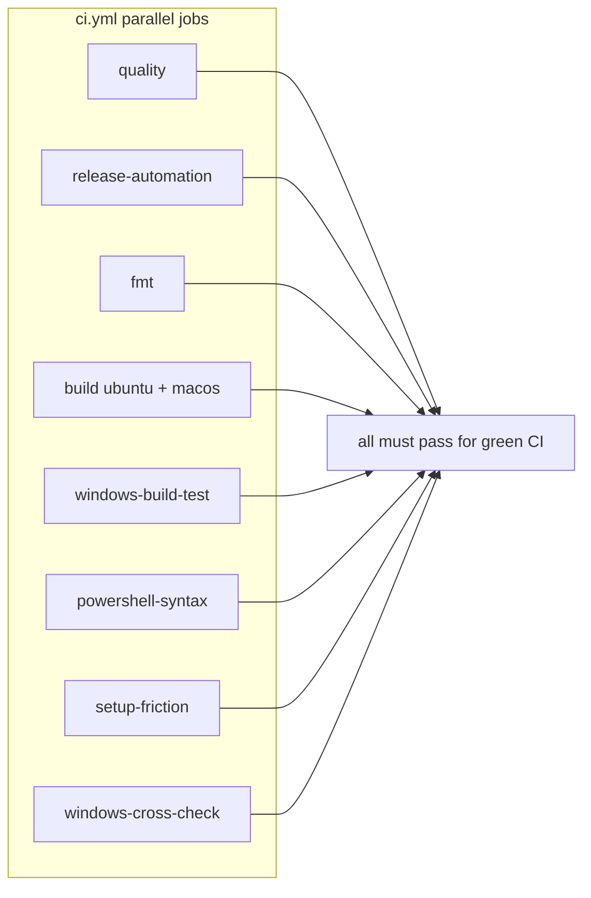

# Local verification vs GitHub CI

This doc maps `.github/workflows/ci.yml` jobs to local commands. It is the reference behind `scripts/verify_local.sh --survey`.

**Pre-push default:** `scripts/verify_local.sh` (Quality Guardrails with `--skip-slow` + Release Automation Python checks).

**Fully offline (no `cargo` compile):** `scripts/verify_local.sh --offline` (Python ratchets, optional secret/permission scan, release-automation unittest).

## Open draft PR survey (usage-burn reliability)

Re-run (read-only): `gh pr list --state open --draft --json number,title,headRefName,state`

| PR | Branch | State | Scope |
|----|--------|-------|--------|
| [#16](https://github.com/trevor-commits/jcode/pull/16) | `cursor/usage-burn-verify-local-32e6` | **Closed** (superseded) | Initial `verify_local.sh`, `rust-toolchain.toml`, CONTRIBUTING links |
| [#17](https://github.com/trevor-commits/jcode/pull/17) | `cursor/usage-burn-reliability-deeper-bbe0` | **Open draft** (canonical) | CI parity matrix, `--survey`, offline path, security preflight hook, doc cross-links |

No other open draft PRs were found for this workstream at the last survey (2026-10-01, cloud agent `bc-24de3f5a-fc01-5a57-8f2c-1ba1dd7b97f6`). Do **not** merge #17 until a human promotes it from draft.

**Re-survey command:** `gh pr list --state open --draft --json number,title,headRefName,updatedAt`

**Agent read-only checklist (no gates):** `scripts/verify_local.sh --checklist`

## How `ci.yml` jobs relate

On every push/PR to `master`, GitHub runs these jobs **in parallel** (concurrency group `ci-${{ github.workflow }}-${{ github.ref }}` cancels superseded runs on the same ref):



`scripts/verify_local.sh` approximates **quality** (with `--skip-slow`) + **release-automation** only. Everything else needs a longer local command, a specific OS, or CI.

The standalone **`fmt`** job duplicates `check_module_files.py` + `cargo fmt --check` from **quality**; both must pass in CI. Local `check_guardrails.sh` / default verify only need to run fmt once.

### CI reliability notes (deeper)

These are the main reasons a commit can look green locally but red in CI (or the reverse), and how this workstream maps them:

| Mechanism | Where | Local implication |
|-----------|--------|-------------------|
| **Concurrency cancel** | `ci.yml` `cancel-in-progress: true` on the same ref | A newer push on your branch cancels in-flight CI; a red run may be stale. Re-run failed jobs or wait for the latest commit. |
| **Per-step timeouts** | `build` uses `.github/scripts/run_with_timeout.py` (600–900s per cohort) | `scripts/test_ci_suites.py` uses similar wall-clock budgets per suite; still not identical to every cohort in `build`. |
| **`RUSTUP_TOOLCHAIN=stable`** | `build` matrix only | Pins toolchain when dependency crates ship nested `rust-toolchain.toml`. Local `cargo` without that env follows repo-root `rust-toolchain.toml` (also stable). |
| **sccache vs plain rustc** | Windows build uses sccache; Linux `build` deliberately avoids mixing sccache with later `cargo test` steps | Rare E0514 / version-stamp mismatches are a CI concern, not `verify_local.sh`. |
| **Silent skip vs real run** | Embedding cohort fetches MiniLM and greps logs so skips fail the job | Offline verify never fetches models; use CI or run the cohort manually when touching embeddings. |
| **OS-specific cohorts** | TUI lib (Linux), secret_input (non-Windows), PowerShell (Windows job) | Full parity needs Linux + macOS + Windows hosts or CI. |
| **Linked issue gate** | `require-issue.yml` on PR open/edit/sync | Draft #17 may need `Closes #N` or Development sidebar link before promotion; unrelated to `verify_local.sh`. |
| **Private git deps** | `DEPLOY_KEY` + ssh-agent when secret is set | Contributors without the key use public checkout; if `cargo` fails fetching a private git dep, that is an environment gap, not a ratchet failure. |

Job-level **timeout-minutes** caps (quality 45, build 75, windows-build-test 150, etc.) are documented in `ci.yml`; local runs are usually limited by RAM and disk before those wall clocks.

## CI job matrix

| CI job | Runner | Covered locally | Local command |
|--------|--------|-----------------|---------------|
| **Quality Guardrails** | `ubuntu-latest` | Partial (default verify) | `scripts/check_guardrails.sh` or `scripts/verify_local.sh` |
| **Release Automation** | `ubuntu-latest` | Yes (default verify) | `python3 -m unittest -v scripts/test_post_discord_release.py` + `py_compile` (wrapped in verify) |
| **Format** | `ubuntu-latest` | Via guardrails | `scripts/check_guardrails.sh` (includes `cargo fmt --check`) |
| **Build & Test** | `ubuntu-latest`, `macos-latest` | Partial | `python3 scripts/test_ci_suites.py` (lib-bins, provider-matrix, e2e); `scripts/test_fast.sh` for inner loop |
| **Build & Test** — security preflight (Linux only) | Linux matrix leg | Optional | `scripts/security_preflight.sh` (CI uses `--strict` + installs `cargo-audit`) |
| **Build & Test** — warning budget (Linux only) | Linux matrix leg | Via full guardrails | `scripts/check_warning_budget.sh` (in guardrails, not `--skip-slow` offline path) |
| **windows-build-test** | `windows-latest` | No | Windows machine or wait for CI |
| **powershell-syntax** | `windows-latest` | No (on Linux) | `./scripts/check_powershell_syntax.ps1` on Windows |
| **setup-friction** | `ubuntu-latest` | Manual | `bash scripts/test_install_conversion.sh`, `bash scripts/setup_friction_eval.sh` |
| **windows-cross-check** | `ubuntu-latest` | Manual | See job in `ci.yml` (cross-target `cargo check`) |

### Build & Test: named cohorts vs `test_ci_suites.py`

The `build` matrix job runs many **targeted** `cargo test` cohorts before the three suites wrapped by `scripts/test_ci_suites.py`. The Python runner mirrors the heavy integration slice (`lib-bins`, `provider-matrix`, `e2e`) but **does not** replace the smaller cohort steps below.

| CI step (build job) | Platforms | In `test_ci_suites.py`? | Local when needed |
|---------------------|-----------|---------------------------|-------------------|
| Compile lib/bin tests (`--no-run`) | all | Partial (`lib-bins` compiles + runs) | `python3 scripts/test_ci_suites.py lib-bins` |
| `retention_readiness` cohort | all | No | `cargo test -p jcode-app-core --lib retention_readiness` |
| `secret_input` pty cohort | non-Windows | No | `cargo test -p jcode-base --lib secret_input` |
| MiniLM embedding stability | Linux only | No | Fetch model per `ci.yml` step, then `cargo test -p jcode-embedding --lib` |
| stdin-forwarding cohort | all | No | `cargo test -p jcode-app-core --lib tool::bash::tests::test_stdin_forwarding` |
| TUI lib tests (serial) | Linux only | No | `COLORTERM=truecolor cargo test -p jcode-tui --lib --test-threads=1` (+ skips in CI) |
| `provider_matrix` / `e2e` | all | Yes | `python3 scripts/test_ci_suites.py provider-matrix e2e` |
| Warning budget | Linux | No (needs `cargo check`) | `scripts/check_warning_budget.sh` (in full guardrails) |
| Security preflight `--strict` | Linux | Optional flag | `scripts/verify_local.sh --with-security-preflight` (non-strict) or install `cargo-audit` + `--strict` |

### Offline ratchet inventory (`verify_local.sh --offline`)

These gates run **without** invoking `cargo check` / clippy (dependency boundaries still need working `cargo metadata`):

| Gate | Script |
|------|--------|
| Module declarations | `scripts/check_module_files.py` |
| Code size | `scripts/check_code_size_budget.py` |
| Test size | `scripts/check_test_size_budget.py` |
| Panic-prone patterns | `scripts/check_panic_budget.py` |
| Swallowed errors | `scripts/check_swallowed_error_budget.py` |
| Wildcard re-exports | `scripts/check_wildcard_reexport_budget.py` |
| Crate dependency boundaries | `scripts/check_dependency_boundaries.py` (skipped if metadata unavailable) |

Intentionally **not** in `--offline`: `check_warning_budget.sh` (compiles), `cargo fmt`, desktop2 frame budget, machete, integration tests.

### Quality Guardrails step-by-step

| CI step | `verify_local.sh` default | `check_guardrails.sh` | `--skip-slow` |
|---------|---------------------------|----------------------|---------------|
| `check_module_files.py` | Indirect (guardrails) | Yes | Yes |
| `cargo fmt --check` | Indirect | Yes | Yes |
| `cargo check --all-targets --all-features` | Skipped | Yes | No |
| `cargo clippy -D warnings` | Skipped | Yes | No |
| `cargo metadata --locked` | Indirect | Yes | Yes |
| Warning / size / panic / swallowed-error ratchets | Indirect | Yes | Yes |
| `check_dependency_boundaries.py` | Indirect | Yes | Yes |
| `check_wildcard_reexport_budget.py` | Offline + guardrails | Yes | Yes |
| desktop2 frame budget test | Indirect | Yes | Yes |
| `cargo machete` | Skipped | If installed | No |

**Profile note:** CI runs `cargo test -p jcode-desktop2 profile::`. Local guardrails use `--profile selfdev` for the same test module to reuse selfdev artifacts; behavior under test is the same sweep.

**Toolchain note:** CI `build` matrix sets `RUSTUP_TOOLCHAIN: stable` so dependency crates cannot override the channel via nested `rust-toolchain.toml`. Local dev uses repo-root `rust-toolchain.toml` (also `stable` + clippy/rustfmt). Run `rustup update stable` before full guardrails.

**Linux deps:** `sudo apt-get install -y libfontconfig1-dev` (required for desktop2 / all-features compile).

## Other GitHub workflows

These run outside the main `ci.yml` PR path. None are invoked by `verify_local.sh`.

| Workflow file | Name | Trigger | Local analogue |
|---------------|------|---------|----------------|
| `ci.yml` | CI | push/PR to `master` | `verify_local.sh`, `check_guardrails.sh`, `test_ci_suites.py` |
| `require-issue.yml` | Require Linked Issue | PR open/edit/sync | Link a real issue in the PR body (`Closes #N` or Development sidebar) |
| `release.yml` | Release | tags / manual | Maintainer-only; uses signing and publish secrets |
| `discord-release.yml` | Announce release on Discord | release published | `scripts/post_discord_release.py` (unittest covered in verify) |
| `windows-smoke.yml` | Windows Smoke | `workflow_dispatch` | Windows host; overlaps partially with `ci.yml` `windows-build-test` |
| `freebsd-smoke.yml` | FreeBSD Smoke | schedule / dispatch | FreeBSD VM or wait for workflow |
| `ios-testflight.yml` | iOS TestFlight | manual / release | macOS + Apple credentials |

## Troubleshooting

| Symptom | Likely cause | Fix |
|---------|--------------|-----|
| `edition2024` / feature errors from `cargo` | Rust stable too old | `rustup update stable` (repo pins `stable` in `rust-toolchain.toml`) |
| `fontconfig.pc` / `yeslogic-fontconfig-sys` build panic | Missing Linux headers | `sudo apt-get install -y libfontconfig1-dev` |
| `cargo metadata` failed in preflight | Same as above, or no network for first fetch | Install deps; ensure network for non-`--offline` runs |
| Default verify fails after ~2 min on desktop2 gate | fontconfig missing (warning used to be easy to miss) | Install fontconfig dev package; `verify_local.sh` now fails fast in preflight |
| Clippy passes locally, fails in CI | Stale `stable` vs CI's current stable | `rustup update stable` before `check_guardrails.sh` without `--skip-slow` |
| `cargo machete` skipped locally | Not installed | `cargo install cargo-machete --locked` (CI always installs) |
| Security preflight warns on audit | `cargo-audit` optional unless `--strict` | Install for parity; CI build job uses `--strict` |
| Windows-only red CI | Cannot reproduce on Linux | Use Windows runner or `windows-smoke` dispatch |
| OOM / build killed mid-guardrails | Low RAM on cloud agent or laptop | Lower `CARGO_BUILD_JOBS`, use `scripts/remote_build.sh`, or `--skip-slow` while iterating |
| `dependency boundaries` skipped offline | `cargo metadata` failed | Fix toolchain/deps; offline path still runs other ratchets |

### Exit codes (`verify_local.sh`)

| Code | Meaning |
|------|---------|
| `0` | All requested gates passed |
| `1` | A gate failed (see output above the summary) |
| `2` | Unknown CLI flag |

## Recommended workflows

```bash
# 1) Print this matrix summary (no gates)
scripts/verify_local.sh --survey

# 2) Pre-push on a laptop (~minutes, no provider keys)
scripts/verify_local.sh

# 3) No compiler / on a plane
scripts/verify_local.sh --offline

# 4) Before a large merge or when CI Quality job failed
scripts/check_guardrails.sh          # install cargo-machete for parity with CI
rustup update stable

# 5) CI-shaped tests (long; needs resources)
python3 scripts/test_ci_suites.py

# 6) Optional: secret scan + script permissions (CI strict also needs cargo-audit)
scripts/verify_local.sh --with-security-preflight
```

## Explicitly out of scope for `verify_local.sh`

- Provider credentials and `scripts/real_provider_smoke.sh`
- `scripts/memory_regression_gate.sh` (pinned local session)
- Windows installer / lifecycle PowerShell suites
- Refactor shadow builds (`scripts/refactor_phase1_verify.sh`)
- Network install steps unless you opt in (`cargo-audit`, `cargo-machete`)

## Verify steps (agent / maintainer checklist)

Print this block without running gates: `scripts/verify_local.sh --checklist`

Read-only survey and offline gates (no `cargo` compile, no external writes):

```bash
cd "$(git rev-parse --show-toplevel)"
gh pr list --state open --draft --json number,title,headRefName,updatedAt
scripts/verify_local.sh --survey
scripts/verify_local.sh --checklist
scripts/verify_local.sh --offline
scripts/verify_local.sh --offline --with-security-preflight   # non-strict audit skip OK
# Linux without libfontconfig1-dev: default verify must exit 1 (preflight fail-fast)
scripts/verify_local.sh; test $? -eq 1
```

**Last offline verify (2026-10-01, `bc-24de3f5a-fc01-5a57-8f2c-1ba1dd7b97f6`):** `--survey`, `--offline`, and `--offline --with-security-preflight` exited `0`; default `verify_local.sh` exited `1` (fontconfig preflight, expected on this host).

Full pre-push path on Linux (needs network for crates + fontconfig):

```bash
sudo apt-get install -y libfontconfig1-dev
rustup update stable
scripts/verify_local.sh
# equivalent gates:
scripts/check_guardrails.sh --skip-slow
python3 -m unittest -v scripts/test_post_discord_release.py
```

**Not required for this draft:** `check_guardrails.sh` without `--skip-slow`, `test_ci_suites.py`, Windows jobs, `security_preflight.sh --strict`, or merging the PR.

Do not commit secrets; `security_preflight` scans tracked files for common patterns only.
